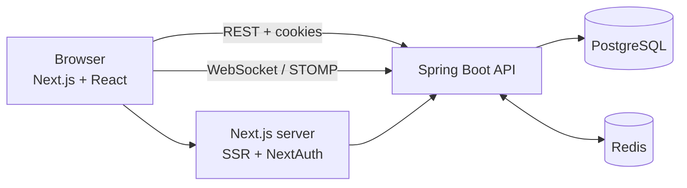

# Chat App

A real-time chat application with friend requests, live online status and typing indicators.

**Stack:** Spring Boot 4 (Java 21) · Next.js 16 / React 19 · PostgreSQL · Redis · WebSocket (STOMP)

## Features

- Sign up / log in with JWT access tokens and rotating refresh tokens (HttpOnly cookies)
- Friend system: search users, send / accept / decline requests, unfriend
- Real-time 1-to-1 messaging with persistent history and infinite scroll
- Live presence (online / offline) and "typing…" indicator
- Responsive UI (mobile and desktop layouts)

## Architecture



| Concern | Technology |
|---|---|
| Request / response (auth, friends, history) | REST (Spring MVC) |
| Live events (messages, presence, typing) | WebSocket + STOMP |
| Durable data | PostgreSQL, schema versioned with Flyway |
| Online status, friend cache, event fan-out | Redis (TTL keys + pub/sub) |
| Server state in the UI | TanStack Query |
| Session / route protection | NextAuth + Next.js `proxy.ts` |

## Technical Highlights

- **Presence with Redis:** heartbeat every 10 s refreshes a 30 s TTL key. Online/offline changes are published on Redis pub/sub so any backend instance can notify the user's friends. A Lua script makes the "first heartbeat" check atomic.
- **Refresh-token rotation with reuse detection:** only SHA-256 hashes are stored; replaying an old token revokes the whole session.
- **Snowflake IDs** for conversations and messages: time-ordered, generated in the app, and sent to the browser as strings to avoid JavaScript precision loss.
- **Schema design:** one conversation / friendship row per user pair (enforced by a `CHECK` on ordered ids); messages use a composite key `(conversation_id, message_id)` so history queries need no extra index.
- **Frontend:** a single shared STOMP connection exposed through React context; messages are pushed into the TanStack Query cache, with scroll-position preservation when older pages load.

## Database

`users` · `friendships` · `friendship_request` · `conversations` · `message` · `refresh_tokens`
(group-chat tables exist but the feature is not implemented yet)

## Run Locally

**Prerequisites:** Java 21, Node 20+, PostgreSQL, Redis

```bash
# 1. Infrastructure
docker run -d --name chat-postgres -e POSTGRES_DB=chatdb \
  -e POSTGRES_USER=<user> -e POSTGRES_PASSWORD=<password> -p 5432:5432 postgres
docker run -d --name chat-redis -p 6379:6379 redis

# 2. Backend (http://localhost:8080)
cd backend
export SPRING_DATASOURCE_USERNAME=<user> SPRING_DATASOURCE_PASSWORD=<password>
export JWT_SECRETKEY=$(openssl rand -base64 32)
./mvnw spring-boot:run

# 3. Frontend (http://localhost:3000)
cd frontend
cp example.env .env      # set BACKEND_API_URL, NEXT_PUBLIC_BACKEND_API_URL,
npm install              # NEXT_PUBLIC_STOMP_URL, NEXTAUTH_SECRET, NEXTAUTH_URL
npm run dev
```

Create two accounts (second one in a private window), add each other as friends, and start chatting.

## Project Structure

```text
backend/src/main/java/.../chat_app/
  auth/  user/  chat/  presence/  typing/  config/  idgen/
backend/src/main/resources/db/migration/   # Flyway V1–V9

frontend/
  app/        # routes, layouts, auth API routes
  features/   # conversations, messages, friendship, user
  providers/  # Stomp, Presence, Typing, Query, Auth
  lib/api/    # server and browser API clients
```

## Roadmap

Group chat · unread counts · read receipts · automated tests · Docker Compose for the full stack
